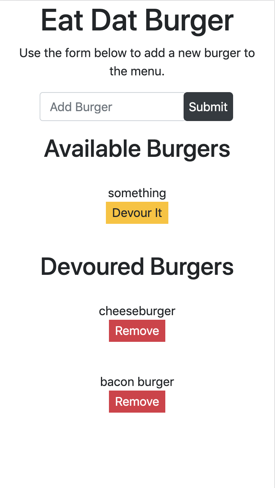

# Eat Dat Burger

A simple app to demonstrate basic usage of a SQL table. Fill out the form to submit the name of the burger you would like added to the "Available Burgers" section of the page. Click 'Devour' next to the burger name, to "Eat" the burger. This updates the burger item in the database, which then moves the burger to the "Devoured Burgers" section. 
[Live app](https://burgery.herokuapp.com/)

Technologies used:

- node.js
- express
- express handlebars
- sequelize

This app was developed by James Cutler, according to instructions from the UNH Coding Bootcamp.